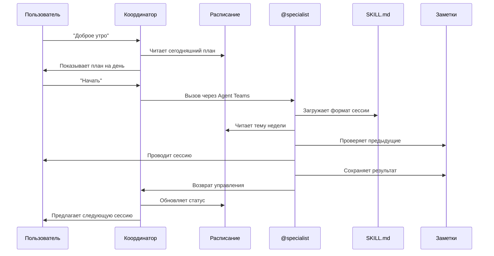

# 🎯 Как работает интегрированная система

## Архитектура

```
Пользователь
     ↓
Координатор (coordinator.md) — читает расписание, управляет процессом
     ↓
@specialist — вызывает нужного специалиста через Agent Teams
     ↓
Специалист (specialist.md) — загружает SKILL.md, проводит сессию
     ↓
SKILL.md (psychologist, meditation-guide, и т.д.) — формат сессии
     ↓
Сохранение заметок → progress/sessions/
     ↓
Обновление расписания → schedule/multiweek-schedule.yaml
     ↓
Возврат к координатору — предложение следующей сессии
```

## Пример полного взаимодействия

### 1. Пользователь обращается утром

```
Пользователь: Доброе утро! Готов начать программу
```

### 2. Координатор читает расписание

Координатор выполняет:
```bash
TODAY=$(date +%Y-%m-%d)
cat schedule/multiweek-schedule.yaml | grep -A 50 "date: '$TODAY'"
```

И отвечает:
```
🌅 Доброе утро! Сегодня 16 февраля 2026, понедельник

📋 План на день:
1. 08:00-08:30 🧘 Медитация | "Основы осознанности"
2. 10:00-11:00 🧠 Психолог | "Знакомство и диагностика эмоционального состояния"
3. 14:00-14:45 💼 Коуч | "Карьерный аудит: где вы сейчас"
4. 19:00-19:30 🧘‍♀️ Йога | "Вечерняя расслабляющая йога"

🎯 Тема дня: "Разум и стратегия"
📊 Неделя 1: Знакомство со всеми специалистами

💡 Готовы начать с утренней медитации?
```

### 3. Пользователь соглашается

```
Пользователь: Да, давай
```

### 4. Координатор вызывает специалиста

Координатор использует Agent Teams:
```
@specialist: Проведи сессию meditation-guide
Контекст:
- Дата: 2026-02-16
- Время: 08:00
- Неделя: 1
- Тема: "Основы осознанности"
```

### 5. Specialist.md активируется

Specialist.md выполняет:
```bash
# Читает формат сессии
cat .claude/skills/meditation-guide/SKILL.md

# Проверяет расписание
grep -A 5 "specialist: meditation-guide" schedule/multiweek-schedule.yaml | grep "2026-02-16"

# Проверяет предыдущие заметки
ls -t progress/sessions/*-meditation-guide.md 2>/dev/null | head -1
```

### 6. Specialist проводит сессию

```
🧘 Здравствуйте! Я ваш гид по медитации.

Сегодня у нас первая встреча на тему: "Основы осознанности"
Это неделя 1 нашей восьминедельной программы.

Медитация осознанности — это практика присутствия в настоящем
моменте без суждений. Она помогает:
- Снизить стресс и тревожность
- Улучшить концентрацию
- Развить эмоциональный интеллект

Давайте начнём с простого упражнения...

[15-минутная управляемая медитация]

...

✅ Отлично! Вы освоили базовую технику наблюдения дыхания.

💡 Ключевые моменты:
- Внимание естественно блуждает — это нормально
- Главное — замечать и мягко возвращать внимание
- Практика — ключ к развитию навыка

📝 Домашнее задание на эту неделю:
- Практикуйте 5 минут утром после пробуждения
- Практикуйте 5 минут вечером перед сном
- Наблюдайте 3 момента осознанности в течение дня
  (еда, ходьба, умывание)

Следующая сессия: 17.02.2026 в 18:00
Тема: "Дыхательные практики"
```

### 7. Specialist сохраняет заметки

Создаёт файл `progress/sessions/2026-02-16-08-00-meditation-guide.md`:

```markdown
# Сессия с гидом по медитации

**Дата:** 2026-02-16 08:00
**Неделя:** 1
**Тема:** Основы осознанности

## Цель сессии
Познакомиться с медитацией осознанности, освоить базовую технику

## Ход сессии
- Объяснение концепции медитации осознанности
- Управляемая практика наблюдения дыхания (15 минут)
- Обсуждение опыта и ответы на вопросы

## Ключевые инсайты
1. Осознал, что ум постоянно блуждает
2. Понял разницу между мышлением и наблюдением
3. Почувствовал расслабление даже за короткую практику

## Домашнее задание
- [  ] Утренняя практика 5 минут × 7 дней
- [  ] Вечерняя практика 5 минут × 7 дней
- [  ] 3 момента осознанности ежедневно

## Следующие шаги
Неделя 2: "Работа с дыханием" — углубление техники

## Связь с другими специалистами
Можно интегрировать с психологом для работы с тревожностью
```

### 8. Возврат к координатору

```
✅ Сессия с медитацией завершена и заметки сохранены!

💡 Вы освоили основы практики осознанности.

⏭ Следующая сессия: 10:00 с психологом
   Тема: "Знакомство и диагностика эмоционального состояния"
   Длительность: 60 минут

Хотите начать сейчас или сделать перерыв до 10:00?
```

## Ключевые отличия от "скриптового" подхода

### ❌ Было (скрипты Python):
- Расписание генерировалось скриптами
- Специалисты не знали о расписании
- Нет реальной координации
- Нет сохранения заметок
- Нет интеграции между сессиями

### ✅ Стало (Agent Teams + Skills):
- Координатор читает расписание в реальном времени
- Использует @specialist для вызова через Agent Teams
- Specialist загружает нужный SKILL.md
- Специалист читает тему из расписания
- Проверяет предыдущие заметки для контекста
- Сохраняет детальные заметки после сессии
- Координатор отслеживает прогресс
- Интеграция между всеми специалистами

## Технический flow



## Команды для проверки работы

### Проверить расписание на сегодня:
```bash
TODAY=$(date +%Y-%m-%d)
cat schedule/multiweek-schedule.yaml | grep -A 50 "date: '$TODAY'"
```

### Проверить заметки сессий:
```bash
ls -lt progress/sessions/ | head -10
```

### Посмотреть последнюю заметку:
```bash
cat $(ls -t progress/sessions/*.md | head -1)
```

### Проверить прогресс:
```bash
# Всего сессий
echo "Всего сессий: 256"

# Завершено
echo "Завершено: $(grep -c 'status: completed' schedule/multiweek-schedule.yaml)"

# Осталось
echo "Осталось: $(grep -c 'status: planned' schedule/multiweek-schedule.yaml)"
```

## Как это использовать

### Вариант 1: Через координатора (рекомендуется)
```
Скажите: "Доброе утро!" или "Покажи план на день"
```

Координатор автоматически:
- Прочитает расписание
- Покажет план
- Предложит начать первую сессию
- Вызовет нужного специалиста через @specialist
- Отследит прогресс

### Вариант 2: Прямой вызов специалиста
```
/meditation-guide
```

Специалист:
- Автоматически прочитает расписание
- Найдёт свою тему недели
- Проверит предыдущие заметки
- Проведёт сессию
- Сохранит результаты

### Вариант 3: Через менеджер сессий
```
/session-manager
```

Менеджер предоставит интерфейс управления сессиями.

---

**Теперь это действительно интегрированная система с Agent Teams! 🎉**
